<p align="center">
  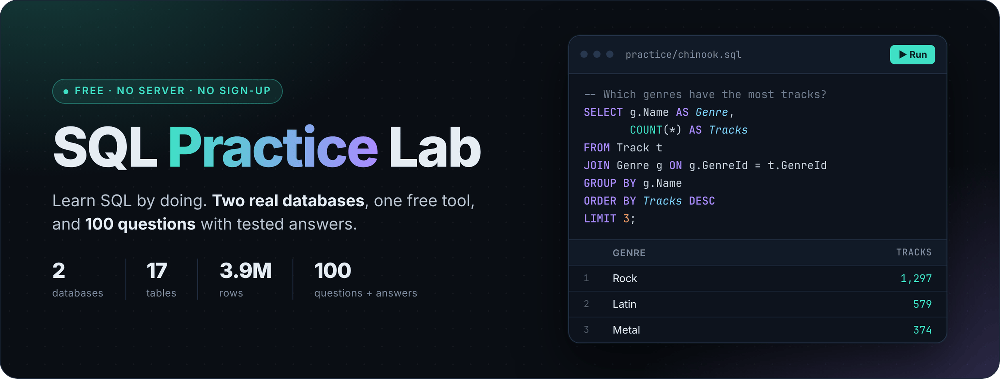
</p>

<p align="center">
  
  
  
  
  <a href="#credits-and-licenses"></a>
  <a href="https://github.com/hesamworkshop/sql-practice-lab/stargazers"></a>
</p>

<p align="center">
  <a href="#quick-start"><b>Quick start</b></a> ·
  <a href="#the-two-databases">The databases</a> ·
  <a href="#the-100-questions">The 100 questions</a> ·
  <a href="#sqlite-cheat-sheet">Cheat sheet</a> ·
  <a href="#faq">FAQ</a> ·
  <a href="#credits-and-licenses">Credits</a>
</p>

You don't learn SQL by reading about it. You learn it by typing a query, pressing run, and looking at what comes back.

This repo gives you everything you need for that:

- **Two ready-made databases.** A small music store and a company with 300,024 employees. Each one is a single file, so there is no server to install and no account to create.
- **100 practice questions**, from your first `SELECT` to the window functions that show up in job interviews. Every answer was run against the real data, and the expected result is written right under it.
- **A picture guide** for [DBeaver Community](https://dbeaver.io/), a free app for Windows, macOS and Linux.
- **Proper credits.** Both databases come with their original licenses and the names of the people who made them.

<p align="center">
  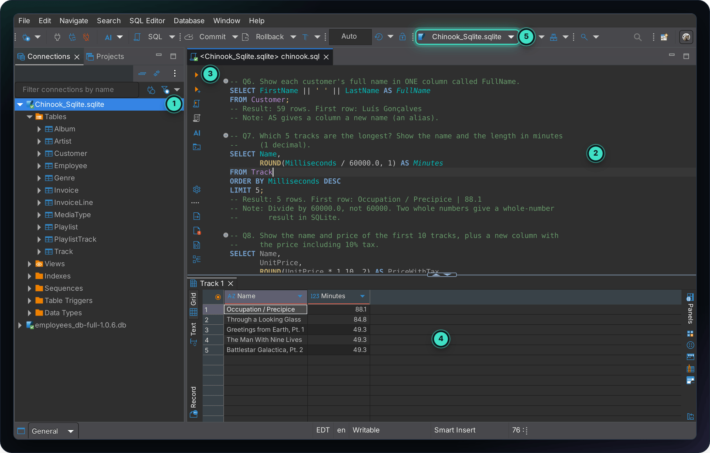
</p>

<p align="center"><sub>
  <b>1</b> your databases and their tables &nbsp;·&nbsp;
  <b>2</b> the question and its answer &nbsp;·&nbsp;
  <b>3</b> run button &nbsp;·&nbsp;
  <b>4</b> the result &nbsp;·&nbsp;
  <b>5</b> the database this file is connected to
</sub></p>

## Quick start

It takes about 10 minutes.

### Step 1. Download three things

| What | Size | Link |
|---|---|---|
| Chinook database | 0.4 MB | **[chinook-sqlite.zip](https://github.com/hesamworkshop/sql-practice-lab/releases/latest/download/chinook-sqlite.zip)** |
| Employees database | 81 MB (about 300 MB unzipped) | **[employees-sqlite.zip](https://github.com/hesamworkshop/sql-practice-lab/releases/latest/download/employees-sqlite.zip)** |
| The practice files | 2 MB | **[this repo as a ZIP](https://github.com/hesamworkshop/sql-practice-lab/archive/refs/heads/main.zip)**, or `git clone` it |

Unzip all three. To keep things tidy, move the two database files into the `databases` folder:

```
sql-practice-lab/
├── databases/
│   ├── Chinook_Sqlite.sqlite          from chinook-sqlite.zip
│   └── employees_db-full-1.0.6.db     from employees-sqlite.zip
└── practice/
    ├── chinook.sql                    60 questions with answers
    ├── employees.sql                  40 questions with answers
    └── quiz/                          the same questions, no answers
```

### Step 2. Install DBeaver Community

Get it from **[dbeaver.io/download](https://dbeaver.io/download/)**, pick your system, and install it with the default options. It is free and open source, and it brings everything it needs, so there is nothing else to install.

<details>
<summary>Prefer a package manager?</summary>

- Windows (Chocolatey): `choco install dbeaver`
- macOS (Homebrew): `brew install --cask dbeaver-community`
- Linux: `.deb`, `.rpm`, Snap and Flatpak are on the same download page

</details>

### Step 3. Connect to the Chinook database

**3.1** Open DBeaver and click **New Database Connection**. It is the plug icon with a plus sign in the top left corner.

<p align="center">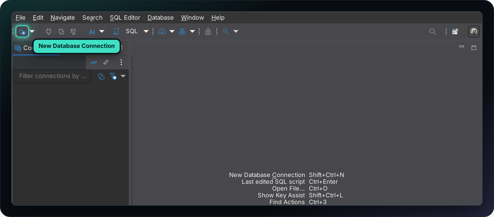</p>

**3.2** Type `sqlite` in the search box, click **SQLite**, then click **Next**.

<p align="center">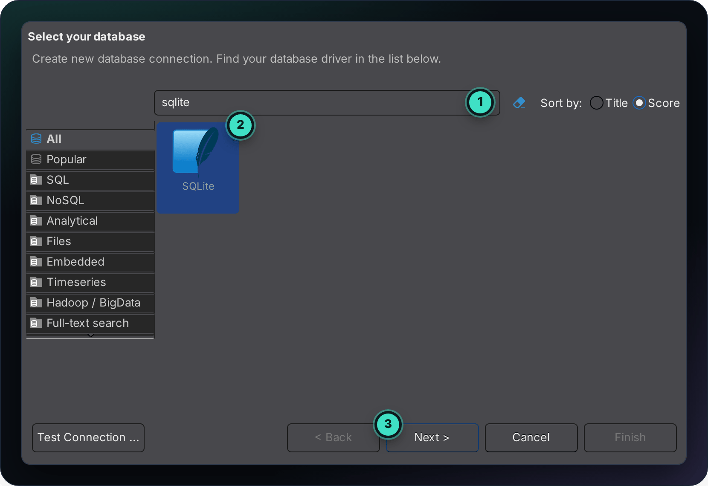</p>

**3.3** Next to **Path**, click **Open …** and choose `Chinook_Sqlite.sqlite`. Then click **Test Connection …**

<p align="center">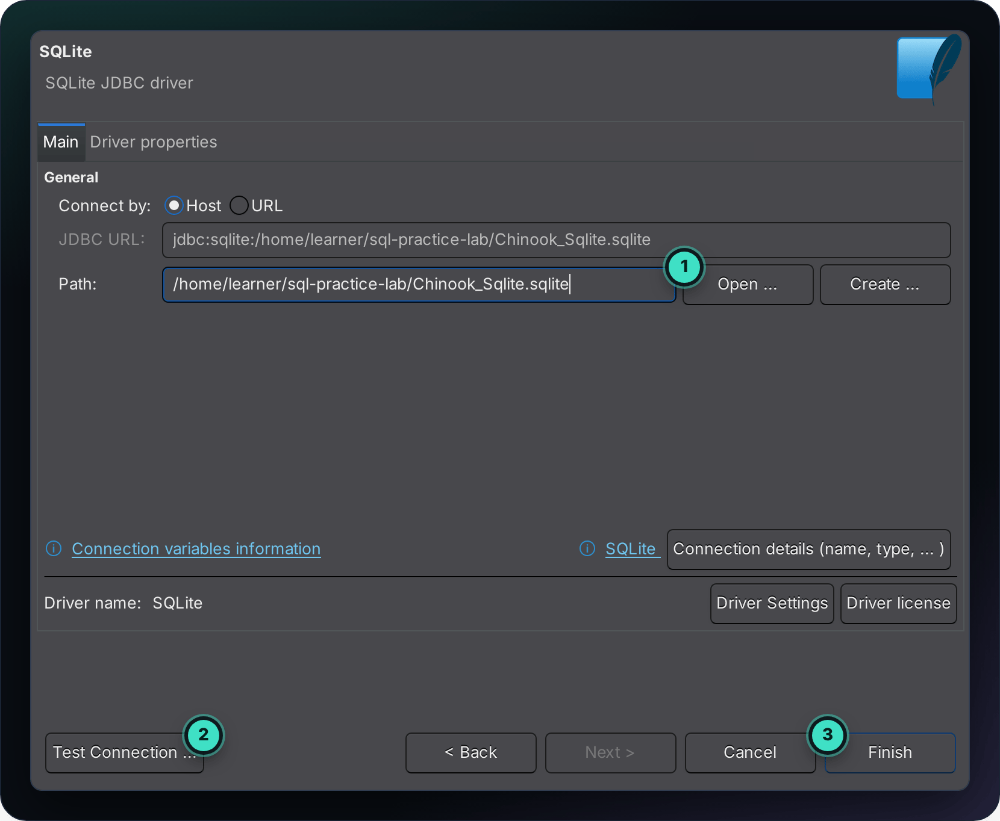</p>

<p align="center"><sub>Your path will look different, for example <code>C:\Users\you\Downloads\sql-practice-lab\databases\Chinook_Sqlite.sqlite</code></sub></p>

**3.4** The first time, DBeaver offers to download the SQLite driver. Click **Download**. When you see **Connected**, click **OK** and then **Finish**.

<p align="center">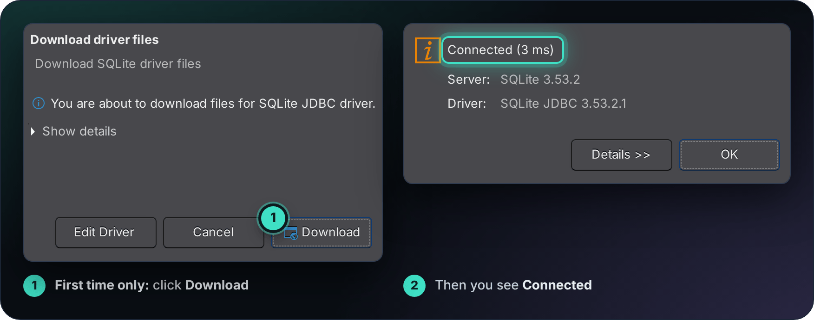</p>

### Step 4. Connect to the Employees database

Do step 3 again, and this time choose `employees_db-full-1.0.6.db`. You now have two connections in the left panel.

### Step 5. Run your first query

**5.1** Choose **File → Open File…** and open `practice/chinook.sql`.

**5.2** DBeaver does not know yet which database this file belongs to, so the toolbar shows `< N/A >`. Click that box.

<p align="center">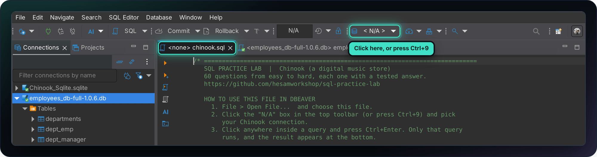</p>

**5.3** Pick **Chinook_Sqlite.sqlite** and click **Select**. DBeaver remembers this for next time.

<p align="center">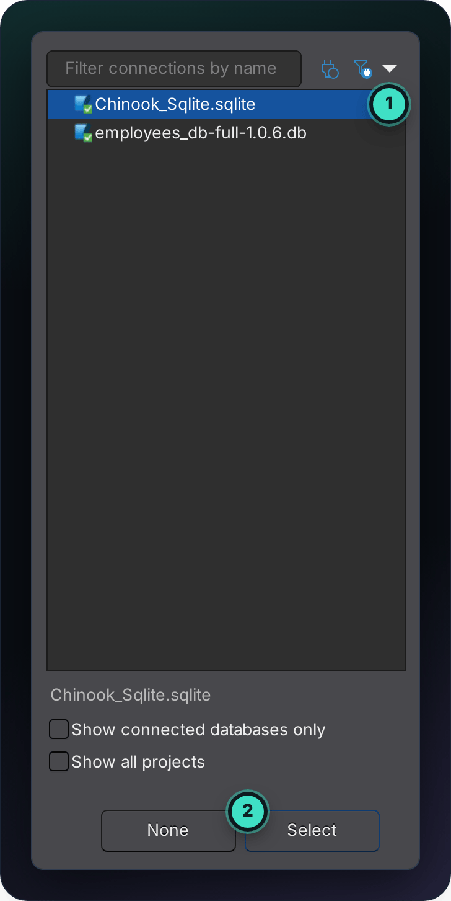</p>

**5.4** Click anywhere inside a query and press <kbd>Ctrl</kbd> + <kbd>Enter</kbd> (on a Mac: <kbd>⌘</kbd> + <kbd>Enter</kbd>). The result shows up at the bottom. That's it, you are practicing SQL.

> [!TIP]
> Run **one query at a time** with <kbd>Ctrl</kbd> + <kbd>Enter</kbd>. The other run button, <kbd>Alt</kbd> + <kbd>X</kbd>, runs the whole file and opens 60 result tabs.

## The two databases

Start with Chinook. It is small, friendly and easy to picture. Move on to Employees when you want to feel what real-world table sizes are like.

### Chinook: a digital music store

Artists, albums and tracks on one side. Customers, invoices and the staff who look after them on the other. 11 tables, 15,607 rows, 1 MB.

<p align="center">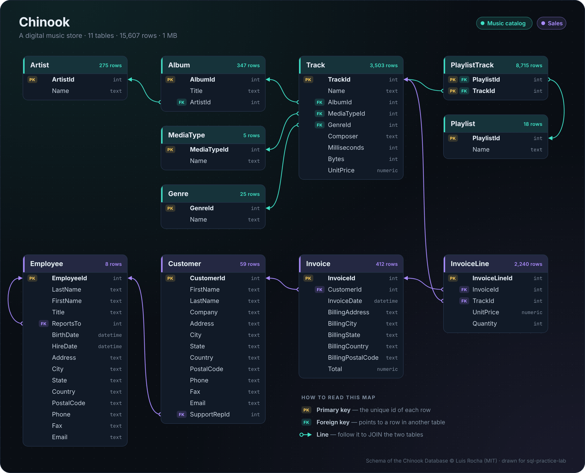</p>

<details>
<summary><b>What is in each table</b></summary>

| Table | Rows | What it holds |
|---|---:|---|
| `Artist` | 275 | Bands and musicians |
| `Album` | 347 | Albums. Each one belongs to one artist |
| `Track` | 3,503 | Songs and videos: name, composer, length, file size, price |
| `Genre` | 25 | Rock, Jazz, Metal, Latin and so on |
| `MediaType` | 5 | File formats, such as MPEG audio |
| `Playlist` | 18 | Named playlists |
| `PlaylistTrack` | 8,715 | Which track is on which playlist |
| `Customer` | 59 | Customers from 24 countries |
| `Employee` | 8 | Staff, including who reports to whom |
| `Invoice` | 412 | One row per purchase, from 2009 to 2013 |
| `InvoiceLine` | 2,240 | The tracks on each invoice |

</details>

Good to know:

- Table names are **singular**: `Track`, `Album`, `Invoice`. Many older tutorials use `tracks` and `albums`, which will not work here.
- Dates are stored as text, like `2011-03-15 00:00:00`.
- Some values are missing on purpose (`NULL`), for example the company of most customers. That is useful for practice.

### Employees: a company with 300,024 people

Six tables that track who worked where, with which title and for what salary, over 17 years. 3.9 million rows, about 300 MB.

<p align="center">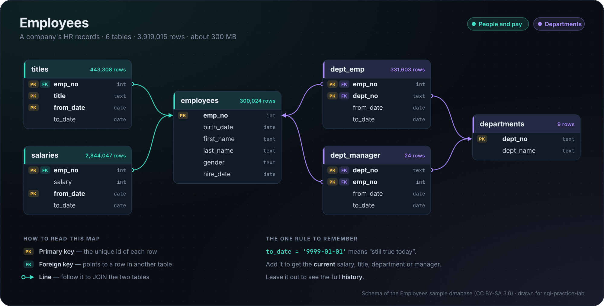</p>

<details>
<summary><b>What is in each table</b></summary>

| Table | Rows | What it holds |
|---|---:|---|
| `employees` | 300,024 | One row per person: name, gender, birth date, hire date |
| `departments` | 9 | The department names |
| `dept_emp` | 331,603 | Who worked in which department, from when to when |
| `dept_manager` | 24 | Who managed which department, from when to when |
| `titles` | 443,308 | Job title history |
| `salaries` | 2,844,047 | Salary history |

</details>

Good to know:

- **The one rule to remember:** a `to_date` of `'9999-01-01'` means "still true today". Add it to your `WHERE` to get someone's current salary, title or department. Leave it out to see the full history.
- This database is big. Add `LIMIT 10` while you are just looking around.
- The data is made up, ends in 2002, and has a few odd spots. Real company data is messy too, so that is good training.

<p align="center">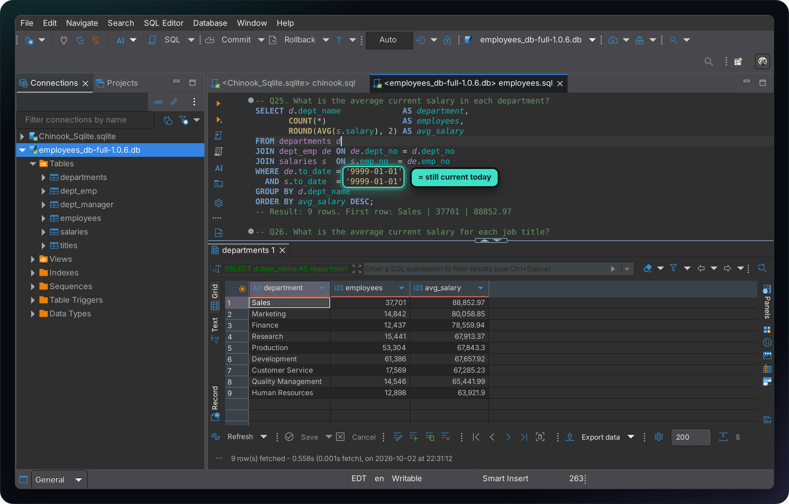</p>

## The 100 questions

<p align="center">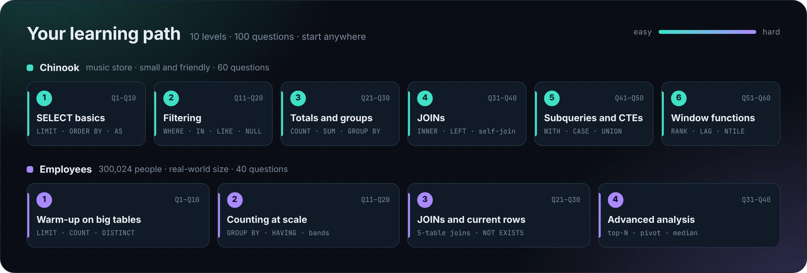</p>

There are two ways to practice. Pick the one that suits you.

| | Open this file | How it works |
|---|---|---|
| **Learn&nbsp;by&nbsp;example** | [`chinook.sql`](practice/chinook.sql) <br> [`employees.sql`](practice/employees.sql) | In the `practice` folder. Each question is followed by its answer and the expected result. Run it, change it, break it, see what happens. |
| **Test&nbsp;yourself** | [`chinook-quiz.sql`](practice/quiz/chinook-quiz.sql) <br> [`employees-quiz.sql`](practice/quiz/employees-quiz.sql) | In the `practice/quiz` folder. Only the questions, with a hint and a `Check:` line. Write your own query, then compare your result with the check. |

Here is what one question looks like:

```sql
-- Q40. Which 10 artists earned the most revenue?
```

<details>
<summary>Show the answer</summary>

```sql
SELECT ar.Name                                   AS Artist,
       ROUND(SUM(il.UnitPrice * il.Quantity), 2) AS Revenue
FROM InvoiceLine il
JOIN Track t   ON t.TrackId   = il.TrackId
JOIN Album al  ON al.AlbumId  = t.AlbumId
JOIN Artist ar ON ar.ArtistId = al.ArtistId
GROUP BY ar.ArtistId, ar.Name
ORDER BY Revenue DESC, ar.Name
LIMIT 10;
-- Result: 10 rows. First row: Iron Maiden | 138.6
```

| Artist | Revenue |
|---|---:|
| Iron Maiden | 138.60 |
| U2 | 105.93 |
| Metallica | 90.09 |
| Led Zeppelin | 86.13 |
| Lost | 81.59 |
| ... | ... |

</details>

### What each level covers

**Chinook** (60 questions)

| Level | Questions | You practice |
|---|---|---|
| 1. SELECT basics | Q1 to Q10 | `SELECT`, `LIMIT`, `DISTINCT`, `ORDER BY`, aliases, simple math |
| 2. Filtering | Q11 to Q20 | `WHERE`, `AND` / `OR`, `IN`, `BETWEEN`, `LIKE`, `IS NULL` |
| 3. Totals and groups | Q21 to Q30 | `COUNT`, `SUM`, `AVG`, `MIN`, `MAX`, `GROUP BY`, `HAVING` |
| 4. JOINs | Q31 to Q40 | `INNER JOIN`, `LEFT JOIN`, joining 3 to 4 tables, self-join |
| 5. Subqueries and CTEs | Q41 to Q50 | Subqueries, `WITH`, `CASE`, `UNION`, dates, text, `COALESCE` |
| 6. Window functions | Q51 to Q60 | `ROW_NUMBER`, `RANK`, `NTILE`, `LAG`, running totals, top N per group |

**Employees** (40 questions)

| Level | Questions | You practice |
|---|---|---|
| 1. Warm-up on big tables | Q1 to Q10 | `LIMIT`, `COUNT`, `WHERE`, `DISTINCT`, sorting by two columns |
| 2. Counting at scale | Q11 to Q20 | `GROUP BY`, `HAVING`, date parts, salary bands, a query inside `FROM` |
| 3. JOINs and current rows | Q21 to Q30 | Joining up to 5 tables, the `'9999-01-01'` rule, `NOT EXISTS` |
| 4. Advanced analysis | Q31 to Q40 | Top N per group, pivot with `CASE`, date math, recursive CTE, median |

## SQLite cheat sheet

SQL is almost the same everywhere, but every database has a few habits of its own. These are the ones you meet in this repo.

| You want to | In SQLite you write |
|---|---|
| Glue text together | `FirstName \|\| ' ' \|\| LastName` |
| Get only the first rows | `LIMIT 10` at the end (not `TOP 10`) |
| Divide without losing decimals | `Milliseconds / 60000.0` (with `.0`) |
| Get the year or month of a date | `strftime('%Y', InvoiceDate)` or `strftime('%m', InvoiceDate)` |
| Count the days between two dates | `julianday(end_date) - julianday(start_date)` |
| Replace a missing value | `COALESCE(Company, 'Individual')` |
| Search inside text | `Name LIKE '%love%'` (upper and lower case both match) |
| Find missing values | `Company IS NULL` (never `= NULL`) |

## FAQ

<details>
<summary><b>DBeaver says "no such table"</b></summary>

Two things to check. First, the box in the toolbar: it must show the right database for the file you have open (Chinook for `chinook.sql`, Employees for `employees.sql`). Second, the spelling: Chinook tables are singular, so it is `Track`, not `Tracks`.

</details>

<details>
<summary><b>DBeaver says "No active connection"</b></summary>

The file is not connected to a database yet. Click the `< N/A >` box in the toolbar, pick a database and click **Select**. See [step 5](#step-5-run-your-first-query).

</details>

<details>
<summary><b>I only see 200 rows, but the table has many more</b></summary>

DBeaver loads 200 rows at a time to stay fast. When there are more, the counter in the bottom right corner shows `200+`. Scroll to the bottom of the result and DBeaver loads the next rows. To know how many rows there are in total, use `COUNT(*)`.

</details>

<details>
<summary><b>Can I break the database?</b></summary>

Not with `SELECT`. Reading data never changes it. If you try `INSERT`, `UPDATE` or `DELETE` and want a fresh start afterwards, unzip the database again.

</details>

<details>
<summary><b>Some Employees queries take a few seconds</b></summary>

That is normal. The `salaries` table has 2.8 million rows. The slowest answers in this repo take a few seconds. Most take less than one.

</details>

<details>
<summary><b>DBeaver could not download the driver</b></summary>

The download in [step 3.4](#step-3-connect-to-the-chinook-database) needs an internet connection, and it only happens once. On an office or school network a firewall can block it. Try again on another network.

</details>

<details>
<summary><b>My DBeaver looks a bit different from the pictures</b></summary>

The pictures were taken with DBeaver Community 26.2.1 in the dark theme. Other versions and the light theme look slightly different, but the steps are the same. The keys shown here are for Windows and Linux. On a Mac, every action is also in the <b>SQL Editor</b> menu with its shortcut next to it.

</details>

<details>
<summary><b>Can I use another tool instead of DBeaver?</b></summary>

Yes. The databases are plain SQLite files and the practice files are plain text, so any SQLite tool works, for example DB Browser for SQLite, the `sqlite3` command line, or a SQLite extension for your code editor.

</details>

<details>
<summary><b>Will what I learn here work in MySQL, PostgreSQL or SQL Server?</b></summary>

Almost all of it. `SELECT`, `WHERE`, `GROUP BY`, `JOIN`, subqueries, CTEs and window functions are standard SQL. The few SQLite habits, mostly around dates and joining text, are listed in the [cheat sheet](#sqlite-cheat-sheet).

</details>

<details>
<summary><b>How can I see how the tables connect inside DBeaver?</b></summary>

Double-click the **Tables** folder of a connection and open the **Diagram** tab.

<p align="center">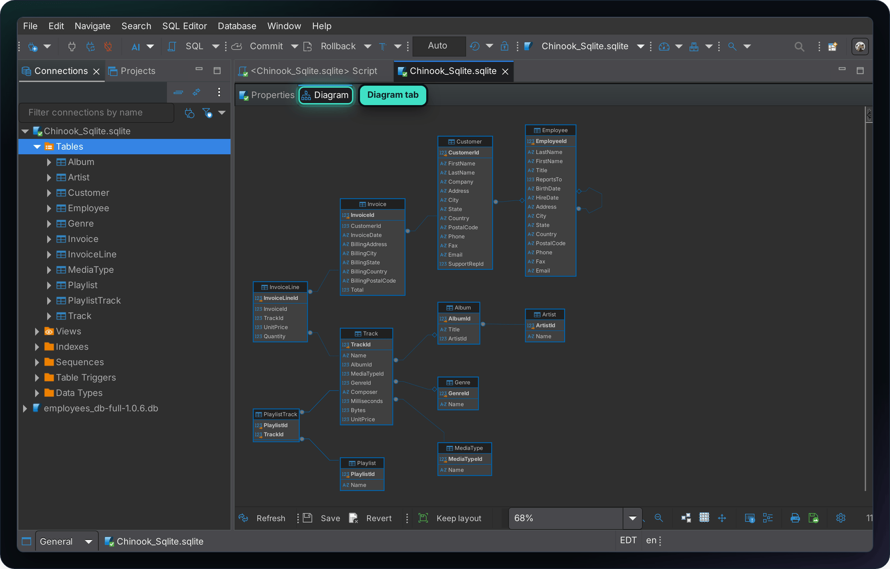</p>

</details>

## Check the answers yourself

Every answer in this repo can be re-run with one command. It needs Python 3 and nothing else. Put the two databases in the `databases` folder first.

```bash
python tools/check_answers.py
```

```
SQLite 3.45.1

Chinook    60 of 60 answers match  (0.0 s)
Employees  40 of 40 answers match  (15.0 s)
```

## Contributing

Found a mistake, or have a good question to add? Open an [issue](https://github.com/hesamworkshop/sql-practice-lab/issues) or a pull request. If you add a question, please include the answer and its `-- Result:` line, and run `python tools/check_answers.py` before you send it. By sending a contribution you agree that it can be published as part of this project.

## Credits and licenses

This project stands on the work of people who made these databases and shared them freely. Thank you.

| What | Made by | License |
|---|---|---|
| **Chinook database** | Luis Rocha. Source: [lerocha/chinook-database](https://github.com/lerocha/chinook-database) | [MIT](licenses/Chinook-LICENSE.md) |
| **Employees database** | Original data by Fusheng Wang and Carlo Zaniolo (Siemens Corporate Research). Relational schema by Giuseppe Maxia. Relational export by Patrick Crews. SQLite port by Peter Reutemann. Sources: [fracpete/employees-db-sqlite](https://github.com/fracpete/employees-db-sqlite), [datacharmer/test_db](https://github.com/datacharmer/test_db) | [CC&nbsp;BY&#8209;SA&nbsp;3.0](licenses/Employees-LICENSE-CC-BY-SA-3.0.txt) |
| **Questions, answers, guide and pictures** | AmirHesam Tech | [All rights reserved](LICENSE.md) |

Both databases are shared **unchanged**. Each download ZIP contains the database together with its license and its credits. The details, including checksums so you can verify the files, are in the [`licenses`](licenses/) folder.

**The databases are free to share.** If you pass on the Employees database, credit the people above, link to the license, and keep it under the same license.

**The questions, guide and pictures are free to use for your own learning.** You are welcome to star, fork and link to this repo. Please ask before you republish them somewhere else, for example in a course, a video or a book. The terms are in [LICENSE.md](LICENSE.md).

This is an independent learning project. It is not affiliated with or endorsed by the database authors, DBeaver or SQLite. All product names belong to their owners.

## About

Made by **[AmirHesam Tech](https://amirhesamtech.com)**. More tech content on TikTok: [@techwithamirh3sam](https://www.tiktok.com/@techwithamirh3sam).

If this repo saved you some time, please give it a star. It helps other learners find it.
